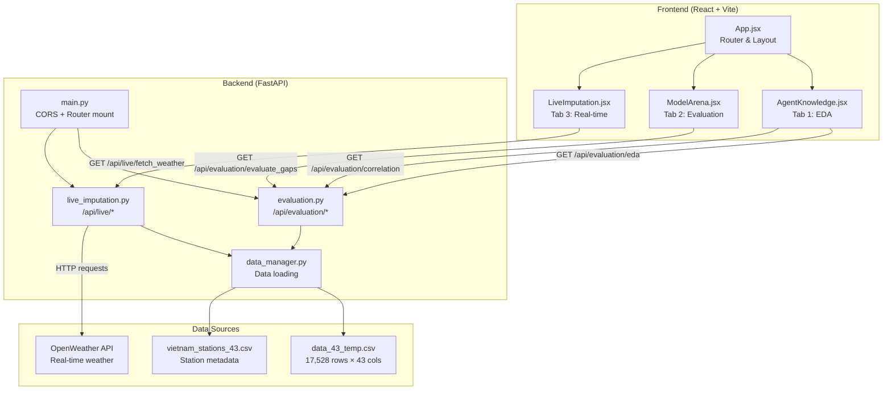
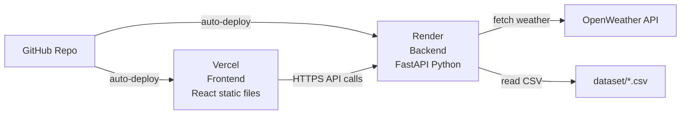

# 🔬 AI Agent Imputer — Phân Tích Kỹ Thuật Toàn Diện & Hướng Dẫn Deploy

Tài liệu này giải thích **chính xác** hệ thống hoạt động như thế nào từ góc nhìn kỹ sư, và hướng dẫn từng bước đưa web lên online.

---

## Phần 1: Kiến Trúc Tổng Quan



> [!IMPORTANT]
> Hệ thống chia làm **2 process độc lập**: Frontend (port 5173) giao tiếp với Backend (port 8000) qua HTTP REST API. Đây là kiến trúc **Client-Server** phổ biến nhất trong web development.

---

## Phần 2: Backend — Từng File Làm Gì

### [main.py](file:///c:/Users/Administrator/2026/AI_AGENT_IMPUTATION/backend/main.py) — Entry Point

```python
app = FastAPI(...)                    # Khởi tạo web server
app.add_middleware(CORSMiddleware, allow_origins=["*"])  # Cho phép frontend gọi API
app.include_router(evaluation.router, prefix="/api/evaluation")  # Mount routes
app.include_router(live_imputation.router, prefix="/api/live")
```

**Tại sao cần CORS?** Khi frontend ở `localhost:5173` gọi backend ở `localhost:8000`, trình duyệt sẽ chặn request (cross-origin). `CORSMiddleware` nói với trình duyệt: "Cho phép mọi origin gọi tới API này."

---

### [data_manager.py](file:///c:/Users/Administrator/2026/AI_AGENT_IMPUTATION/backend/data_manager.py) — Layer Truy Xuất Dữ Liệu

| Hàm | Chức năng |
|-----|-----------|
| `load_data()` | Đọc 2 file CSV, rename cột theo WMO Code. Trả về `(df_temp, df_st)` |
| `generate_eda()` | Tính mean/std/min/max/missing cho mỗi trạm. Trả về `(eda_stats, station_stats)` |

**Chi tiết quan trọng:** Cột gốc trong CSV có tên kiểu `48/86` nhưng WMO Code chuẩn là `48886`. Hàm `load_data()` dùng `rename(columns=name_mapping)` để chuẩn hóa.

---

### [evaluation.py](file:///c:/Users/Administrator/2026/AI_AGENT_IMPUTATION/backend/routers/evaluation.py) — Bộ Não Của Hệ Thống (309 dòng)

Đây là file phức tạp nhất. Có **3 endpoints**:

#### `GET /api/evaluation/eda`
Trả về tổng quan dữ liệu + time-series mẫu + missing calendar.

#### `GET /api/evaluation/correlation`
Tính ma trận tương quan kết hợp theo công thức bạn yêu cầu:
```python
corr = (pearson.abs() + spearman.abs()) / 2   # Hybrid scoring
# Chỉ giữ cặp có corr >= 0.8
```
Trả về dạng network: `{nodes: [...], links: [{source, target, value}]}`

#### `GET /api/evaluation/evaluate_gaps?station_id=48805&gap_type=7` ⭐ CORE

Đây là endpoint cốt lõi — pipeline AI đầy đủ chạy trong **1 API call**:

```
Bước 1: Tìm 3 trạm lân cận gần nhất (Haversine distance)
Bước 2: Feature Engineering (hour, month, dayofyear, lag1, lag3 của neighbor)
Bước 3: Tạo 10 gaps ngẫu nhiên (anti-overlap) theo số ngày requested
Bước 4: Train 5 models trên dữ liệu không bị khuyết
Bước 5: Predict giá trị trong gap
Bước 6: Đánh giá bằng RMSE, R², FB, FSD → Xếp hạng → Chọn best model
Bước 7: Sinh plot data cho gap đầu tiên
```

**5 models được đánh giá:**

| Model | Loại | Cách hoạt động |
|-------|------|----------------|
| LOCF | Baseline | Lấy giá trị cuối cùng trước gap, lặp lại |
| Linear Interpolation | Baseline | Nối 2 đầu gap bằng đường thẳng |
| Spline Interpolation | Baseline | Nối bằng đường cong bậc 3 |
| Random Forest | ML | Dùng feature thời gian + 3 trạm lân cận |
| LightGBM | ML | Gradient boosting, nhanh hơn RF |

**Scoring formula:**
```python
score = (1/(rmse+0.01)) + (0.3/max(0.01, abs(fb))) + (0.2/max(0.01, abs(fsd)))
```
Ưu tiên: RMSE thấp + FB gần 0 (bias thấp) + FSD gần 0 (variance bảo toàn).

---

### [live_imputation.py](file:///c:/Users/Administrator/2026/AI_AGENT_IMPUTATION/backend/routers/live_imputation.py) — Real-time Demo

```
Bước 1: ThreadPoolExecutor gọi OpenWeather API cho 43 trạm (song song 10 luồng)
Bước 2: Mask ~20% trạm thành công → Giả lập sensor failure
Bước 3: Inverse-distance weighted KNN imputation cho trạm bị mất
Bước 4: Tính FB/FSD thực tế (so với giá trị gốc đã giấu)
```

> [!NOTE]
> Lý do mask 20%: OpenWeather API rất ổn định, gần như không bao giờ trả lỗi. Nếu không mask, AI imputation engine sẽ không bao giờ được kích hoạt → Không demo được gì.

---

## Phần 3: Frontend — Từng Component

### [index.css](file:///c:/Users/Administrator/2026/AI_AGENT_IMPUTATION/frontend/src/index.css) — Design System

| CSS Class | Mục đích |
|-----------|----------|
| `.glass-panel` | Background trong suốt + blur + border mờ (Glassmorphism) |
| `.glass-hover` | Hiệu ứng hover: nâng lên 4px + glow shadow |
| `.title-shimmer` | Gradient text chạy qua chạy lại (shimmer animation) |
| `.orb-1/2/3` | Khối cầu nền trôi nổi chậm rãi (20-30 giây/vòng) |
| `.panel-glow` | Border main panel nhấp nháy nhẹ |
| `.status-dot-live/imputed` | Dots xanh/vàng nhấp nháy ở Tab 3 |

### [App.jsx](file:///c:/Users/Administrator/2026/AI_AGENT_IMPUTATION/frontend/src/App.jsx)

Layout chính: Header (badge + title + nav tabs) → Main content (tab switching) → Footer.
Tab navigation sử dụng `useState('knowledge')` đơn giản, không dùng React Router vì chỉ có 1 trang.

### [AgentKnowledge.jsx](file:///c:/Users/Administrator/2026/AI_AGENT_IMPUTATION/frontend/src/components/AgentKnowledge.jsx) — Tab 1

Gọi 2 API khi mount: `/eda` + `/correlation`. Render 4 stat cards → Leaflet map (650px height) → 2 Recharts (BarChart + LineChart) → Completeness Heatmap → Correlation Bridges.

### [ModelArena.jsx](file:///c:/Users/Administrator/2026/AI_AGENT_IMPUTATION/frontend/src/components/ModelArena.jsx) — Tab 2

State phức tạp nhất: `stations`, `stationId`, `gapType`, `loading`, `results`, `pipelineStep`.
Khi nhấn Run: `setInterval` mỗi 2.5s tăng `pipelineStep` → hiện pipeline progress. Đồng thời gọi API thực sự. Khi API trả về → clear interval, show results.

### [LiveImputation.jsx](file:///c:/Users/Administrator/2026/AI_AGENT_IMPUTATION/frontend/src/components/LiveImputation.jsx) — Tab 3

Gọi `/fetch_weather` khi mount + khi nhấn Sync. Render stat cards (live/imputed/model) → metrics banner → searchable table 43 trạm.

---

## Phần 4: Cây Thư Mục Chuẩn Cho GitHub

```
AI_AGENT_IMPUTATION/
├── .gitignore              # Loại trừ node_modules, venv, __pycache__
├── README.md               # Mô tả project + Quick Start
│
├── backend/                # ← Python FastAPI server
│   ├── main.py             # Entry point
│   ├── data_manager.py     # Data loading utility
│   ├── requirements.txt    # pip dependencies
│   └── routers/
│       ├── evaluation.py   # EDA + Correlation + Gap Evaluation
│       └── live_imputation.py  # Real-time OpenWeather + AI
│
├── frontend/               # ← React + Vite + Tailwind v4
│   ├── index.html          # HTML entry point
│   ├── package.json        # npm dependencies
│   ├── vite.config.js      # Vite + Tailwind plugin config
│   └── src/
│       ├── main.jsx        # React root render
│       ├── App.jsx          # Main layout
│       ├── index.css       # Design system (glassmorphism etc.)
│       └── components/
│           ├── AgentKnowledge.jsx
│           ├── ModelArena.jsx
│           └── LiveImputation.jsx
│
├── dataset/                # ← CSV data files
│   ├── data_43_temp.csv    # 17,528 rows × 43 stations
│   └── vietnam_stations_43.csv  # Station metadata
│
└── notebook/               # ← Research notebooks
    └── generate_missing.py # Reference gap generation script
```

> [!WARNING]
> Các thư mục sau **KHÔNG** được push lên GitHub: `node_modules/`, `venv/`, `__pycache__/`, `.agent/`, `notebooklm-py/`

---

## Phần 5: Hướng Dẫn Deploy Lên Vercel (Từng Bước)

> [!IMPORTANT]
> **Vercel chỉ host được Frontend (static files).** Backend Python cần host trên dịch vụ khác (Render.com miễn phí). Đây là kiến trúc phổ biến nhất cho web app hiện đại.

### Bước 1: Deploy Backend lên Render.com (Miễn phí)

1. Vào [https://render.com](https://render.com) → Sign up bằng GitHub
2. Click **"New" → "Web Service"** → Kết nối repo GitHub
3. Cấu hình:
   - **Root Directory:** `backend`
   - **Build Command:** `pip install -r requirements.txt`
   - **Start Command:** `uvicorn main:app --host 0.0.0.0 --port $PORT`
   - **Plan:** Free
4. Render sẽ cho bạn URL dạng: `https://ai-agent-imputer.onrender.com`

> [!CAUTION]
> Free tier của Render sẽ "sleep" sau 15 phút không có request. Request đầu tiên sau khi sleep sẽ mất ~30-60s để khởi động lại. Đây là giới hạn của free tier.

### Bước 2: Cập nhật Frontend trỏ đến Backend URL

Hiện tại frontend hardcode `http://127.0.0.1:8000`. Cần đổi thành URL Render:

**Tạo file `.env` trong thư mục `frontend/`:**
```env
VITE_API_URL=https://ai-agent-imputer.onrender.com
```

**Sửa tất cả axios calls** trong 3 component files, thay:
```javascript
// Trước:
axios.get('http://127.0.0.1:8000/api/evaluation/eda')

// Sau:
const API = import.meta.env.VITE_API_URL || 'http://127.0.0.1:8000'
axios.get(`${API}/api/evaluation/eda`)
```

### Bước 3: Deploy Frontend lên Vercel

1. Vào [https://vercel.com](https://vercel.com) → Sign up bằng GitHub
2. Click **"Add New" → "Project"** → Import repo GitHub
3. Cấu hình:
   - **Framework Preset:** Vite
   - **Root Directory:** `frontend`  ← ⚠️ QUAN TRỌNG: chọn `frontend`, KHÔNG phải root
   - **Build Command:** `npm run build`
   - **Output Directory:** `dist`
   - **Environment Variable:** Thêm `VITE_API_URL` = URL Backend từ Render
4. Click **Deploy**

### Bước 4: Push code lên GitHub

```bash
# Trong terminal tại thư mục AI_AGENT_IMPUTATION
git add .
git commit -m "feat: complete AI Agent Imputer with 3 tabs + premium UI"
git push origin main
```

Sau khi push, Vercel sẽ tự động build và deploy. Bạn sẽ nhận được URL dạng:
`https://ai-agent-imputation.vercel.app`

### Tóm tắt luồng Deploy



---

## Phần 6: Checklist Trước Khi Deploy

- [ ] Đã tạo file `frontend/.env` với `VITE_API_URL`
- [ ] Đã sửa axios calls trong 3 component files dùng `import.meta.env.VITE_API_URL`
- [ ] Đã commit và push lên GitHub
- [ ] Backend đã chạy trên Render (test bằng cách mở URL + `/docs`)
- [ ] Frontend đã build thành công trên Vercel
- [ ] Test thử mở web → Tab 1 load → Tab 2 chạy evaluate → Tab 3 sync 43 trạm
